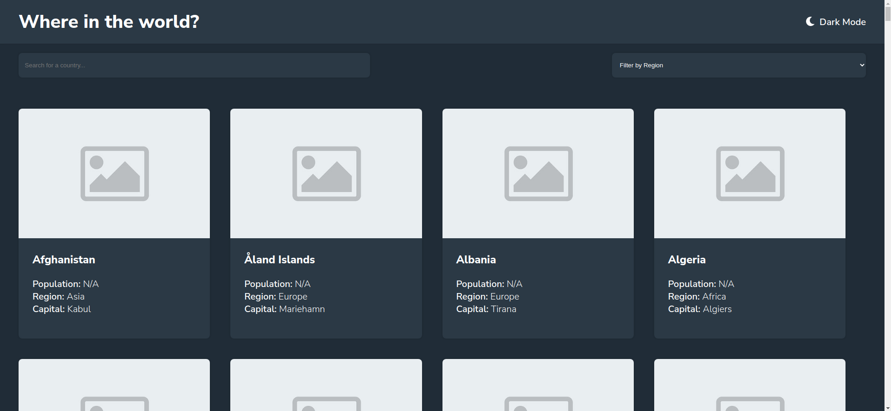
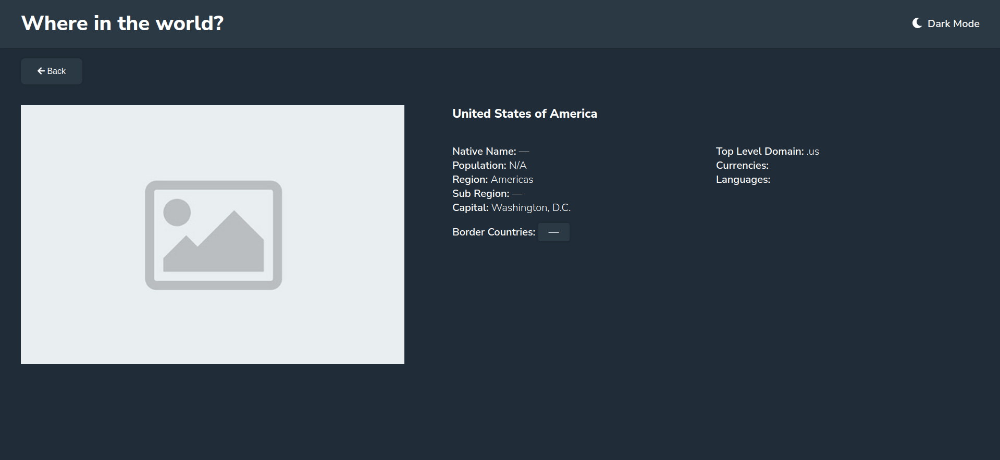

# Zyda Frontend Test - REST Countries API with color theme switcher

This is a solution to the [REST Countries API with color theme switcher task](https://github.com/zydalabs/FrontEnd-Test). Zyda Frontend Task helps us test your coding skills by building a realistic project.

## Table of contents

- [Overview](#overview)
  - [The task](#the-task)
  - [Screenshot](#screenshot)
  - [Links](#links)
- [My process](#my-process)
  - [Built with](#built-with)
  - [What I learned](#what-i-learned)
- [Author](#author)

**Note: Delete this note and update the table of contents based on what sections you keep.**

## Overview

### The task

Users should be able to:

- See all countries from the API on the homepage
- Search for a country using an `input` field
- Filter countries by region
- Click on a country to see more detailed information on a separate page
- Click back button to return to countries page from the details page
- Toggle the color scheme between light and dark mode _(optional)_

### Screenshot





### Links

- Solution URL: [GitHub](https://github.com/georgesamir21/where-in-the-world)

## My process

### Built with

- Semantic HTML5 markup
- SCSS custom properties
- Flexbox
- Mobile-first workflow
- [React](https://reactjs.org/) - JS library
- [TypeScript](http://typescriptlang.org/)

### What I learned

Toggle DarkTheme


```ts
export const changeTheme = (theme: Theme) => {
  let cssRule;
  switch (theme) {
    case 'dark':
      cssRule = `
            :root {
                --background: hsl(207, 26%, 17%);
                --text-color: hsl(0, 0%, 100%);
                --elements: hsl(209, 23%, 22%);
                --input-color: hsl(0, 0%, 100%);
            }
            `;
      break;
    case 'light':
    default:
      cssRule = `
            :root {
                --background: hsl(0, 0%, 98%);
                --text-color: hsl(200, 15%, 8%);
                --elements: hsl(0, 0%, 100%);
                --input-color: hsl(0, 0%, 52%);
            }
            `;
      break;
  }
  const styleSheets = document.styleSheets[document.styleSheets.length - 1];
  styleSheets.insertRule(cssRule, styleSheets.cssRules.length);
};
```

## Author

- [George Samir](https://github.com/georgesamir21)
